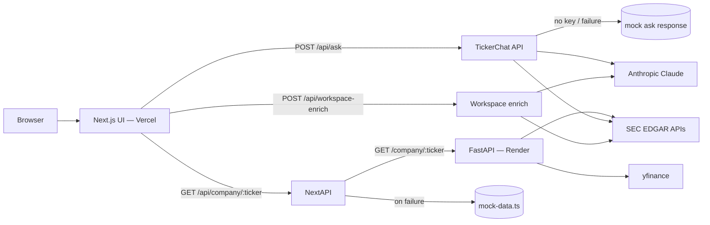

# TickerSense — Project Session Summary

**Project:** TickerSense — SEC Research Copilot for U.S. public companies  
**Type:** Hackathon MVP  
**Repository:** [github.com/pratyushagarwal22/tickersense](https://github.com/pratyushagarwal22/tickersense)  
**Development:** Built iteratively with Cursor + Claude (Anthropic API)

---

## Executive summary

TickerSense is a one-stop SEC research workspace. Users search a ticker and land on a company dashboard that combines filing metadata, a lightweight financial snapshot, market context, AI-generated section summaries, and an evidence-grounded chat assistant (**TickerChat**). The product keeps **facts separated from synthesis** and includes disclaimers that it is research support only—not investment advice.

The project was scaffolded from a detailed product prompt, brought to live SEC data, extended with PDF export and deep filing context for AI Q&A, polished for demo UX, and deployed as a split stack: **Next.js on Vercel** and **FastAPI ingestion on Render**.

---

## Problem statement

Public company research is fragmented across SEC EDGAR, market data sites, and multiple filing types (10-K, 10-Q, 8-K, DEF 14A). Researchers lose context when jumping between sources, and generic AI chat tools often answer without citing official filings.

TickerSense centralizes the workflow: one workspace per ticker, with links and excerpts grounded in SEC sources.

---

## What we built

### Phase 1 — Monorepo MVP scaffold

- **Monorepo layout:**
  - `apps/web` — Next.js 14 (App Router), TypeScript, Tailwind CSS
  - `services/ingestion` — FastAPI (Python 3.11) ingestion service
  - `supabase/` — Postgres schema for optional persistence
  - `docs/` — architecture, API contract, ingestion notes
- **Home page** with ticker search and example chips
- **Company workspace** at `/company/[ticker]` with:
  - Insight cards
  - Filing list (10-K, 10-Q, 8-K, DEF 14A)
  - Filing section placeholders
  - Financial snapshot (SEC XBRL, best-effort)
  - Market metrics and price history
  - Governance summary
- **Resilient fallbacks:** mock company data and mock TickerChat responses when services or API keys are unavailable

### Phase 2 — Live data and AI copilot

- Connected the web app to the Python ingestion service via `INGESTION_SERVICE_URL`
- Configured SEC fair-access `SEC_USER_AGENT` for live EDGAR requests
- Integrated **Anthropic Claude** for grounded Q&A (`POST /api/ask`)
- Fixed SEC filing links to open correct archive/viewer URLs (not just the EDGAR home page)
- Renamed **Ask Copilot** → **TickerChat**
- Added **chat history** per ticker in `sessionStorage` (`lib/chat-storage.ts`)

### Phase 3 — Research workspace enhancements

- **Revenue trends chart** (`FinancialTrendsChart`) from SEC XBRL, scoped to ~5 years
- **Share price chart** (`MarketChart`) with optional S&P 500 benchmark, indexed for apples-to-apples comparison
- Charts stacked vertically: share price above revenue trends
- **PDF export** (`CompanyToolbar` + `company-report-pdf.tsx` via `@react-pdf/renderer`):
  - Website-like styling (not a plain text dump)
  - Clickable SEC hyperlinks in the PDF
  - “Return to live workspace” link at the top of the export
  - TickerChat transcript included when the user has chat history
- **Workspace enrichment** (`POST /api/workspace-enrich`):
  - Background fetch of 10-K / 10-Q / DEF 14A plain text after page load
  - AI-generated section summaries, filing guides, and governance notes
- **Question-specific filing supplements** (`lib/ask-filing-supplement.ts`):
  - On each TickerChat turn, fetches deeper excerpts when the question implies risk factors (Item 1A), MD&A, proxy/governance, or prior-year 10-K comparison
  - Keeps two most recent 10-Ks in ingestion metadata for YoY risk-factor analysis

### Phase 4 — UX polish and production deployment

- TickerChat loading UX: fixed-width Ask button, spinner, and cycling status messages above the input (“Reading SEC filings…”, “Pulling company disclosures…”, etc.)
- Fixed loading text flash, chart label overlap with benchmark line, and status-message pacing
- **New-tab navigation** for tickers and SEC reference links without `about:blank` flash (programmatic `<a target="_blank">` click)
- Company page **loading skeleton** (`app/company/[ticker]/loading.tsx`)
- Copy-link and download-PDF actions in the company toolbar
- Deployed frontend to **Vercel** and ingestion API to **Render**

---

## Architecture



### Frontend (`apps/web`)

| Area | Details |
|------|---------|
| Framework | Next.js 14 App Router, React 18, TypeScript |
| Styling | Tailwind CSS, Lucide icons |
| Charts | Recharts (price + revenue trends) |
| PDF | `@react-pdf/renderer` |
| Validation | Zod on API route bodies |
| Key routes | `/`, `/company/[ticker]` |
| API routes | `GET /api/company/[ticker]`, `POST /api/ask`, `POST /api/workspace-enrich` |

**Notable UI modules:**

- `components/company/company-workspace.tsx` — main dashboard layout; triggers background enrichment
- `components/company/ask-copilot.tsx` — TickerChat panel with history and loading states
- `components/company/company-toolbar.tsx` — PDF download, copy page link
- `components/company/company-report-pdf.tsx` — full-page PDF document
- `components/company/market-chart.tsx`, `financial-trends-chart.tsx` — market and revenue visuals
- `components/search/company-search.tsx` — opens workspace in a new tab with immediate URL

### Backend (`services/ingestion`)

| Area | Details |
|------|---------|
| Framework | FastAPI, uvicorn |
| HTTP client | httpx with retries (tenacity) |
| Parsing | BeautifulSoup / lxml for future HTML work; shallow section placeholders today |
| Market | yfinance — price history, SMA20/50/200, RSI(14), 52-week high/low |

**Ingestion pipeline (per ticker):**

1. Resolve CIK via SEC `company_tickers.json`
2. Fetch submissions JSON for recent filing metadata
3. Select latest 10-K (up to 2), 10-Q, 8-K, DEF 14A
4. Build archive, index, and SEC viewer URLs
5. Fetch XBRL company facts for a small set of `us-gaap` tags
6. Download market history and compute technical indicators
7. Return normalized `CompanyPayload` JSON

**Endpoints:**

- `GET /health` → `{ "status": "ok" }`
- `GET /company/{ticker}` → company payload or 404/500

### Data layer (`supabase/`)

Schema prepared for:

- `companies`, `filings`, `filing_sections`, `market_snapshots`
- `chat_sessions`, `chat_messages`

Supabase is **optional** for the MVP. The app runs without it; chat history currently lives in browser `sessionStorage`.

---

## API contract (summary)

See `docs/api-contract.md` for full shapes.

| Endpoint | Purpose |
|----------|---------|
| `GET /api/company/[ticker]` | Proxy to ingestion; fallback to `mock-data.ts` |
| `POST /api/ask` | TickerChat — grounded JSON answer with bullets, sources, disclaimer |
| `POST /api/workspace-enrich` | AI summaries from fetched filing text |
| `GET /company/{ticker}` (FastAPI) | Authoritative company payload for the web BFF |

**TickerChat response fields:** `answer`, `bullet_points`, `supporting_sources`, `unanswered_questions`, `disclaimer`

---

## Key technical decisions

| Decision | Rationale |
|----------|-----------|
| **BFF pattern in Next.js** | Browser never calls SEC directly; secrets stay server-side; single JSON contract for the UI |
| **Python ingestion service** | SEC parsing, XBRL, and HTML extraction fit the Python ecosystem; isolates rate limits from the frontend |
| **Facts vs synthesis in UI** | Insight cards and AI boxes are visually distinct from raw filing metadata and numeric facts |
| **Mock fallback everywhere** | Demo-ready when SEC throttles, ingestion is down, or API keys are missing |
| **Session storage for chat** | Fast MVP without auth; PDF export can still include the session transcript |
| **On-demand filing supplements** | Full 10-K text is too large for every request; fetch deep excerpts only when the question needs them |
| **Two recent 10-Ks** | Enables year-over-year risk-factor comparison in TickerChat |
| **React-PDF over print-to-PDF** | Control over layout, hyperlinks, and inclusion of chat history |
| **New-tab workspaces** | Users keep their home/search tab while opening multiple tickers or SEC documents |

---

## Environment variables

Configured via `.env.example`, `apps/web/.env.local`, and `services/ingestion/.env`:

| Variable | Where | Purpose |
|----------|-------|---------|
| `INGESTION_SERVICE_URL` | Web (server) | URL of FastAPI service (local or Render) |
| `ANTHROPIC_API_KEY` | Web (server) | TickerChat + workspace enrichment |
| `ANTHROPIC_MODEL` | Web (server) | Optional model override |
| `OPENAI_API_KEY` | Web (server) | Optional alternate provider |
| `SEC_USER_AGENT` | Ingestion | Required SEC fair-access identifier |
| `NEXT_PUBLIC_SUPABASE_URL` | Web | Optional persistence |
| `NEXT_PUBLIC_SUPABASE_ANON_KEY` | Web | Optional persistence |
| `NEXT_PUBLIC_APP_URL` | Web | Optional canonical URL for PDF “return to workspace” links |

**Never commit real API keys.** Use platform secret managers in production (Vercel Environment Variables, Render Environment).

---

## Deployment

### Production topology

| Component | Platform | Notes |
|-----------|----------|-------|
| Next.js frontend | **Vercel** | Root or `apps/web` as project directory; set env vars in Vercel dashboard |
| FastAPI ingestion | **Render** | Web service running `uvicorn app.main:app`; set `SEC_USER_AGENT` and CORS `FRONTEND_ORIGIN` |
| Source control | **GitHub** | `pratyushagarwal22/tickersense` |

### Local development

```bash
# Terminal 1 — ingestion
cd services/ingestion
python3 -m venv .venv && source .venv/bin/activate
pip install -r requirements.txt
export SEC_USER_AGENT="Your Name your-email@example.com"
uvicorn app.main:app --reload --port 8001

# Terminal 2 — web
cd apps/web
npm install
npm run dev
```

Set `INGESTION_SERVICE_URL=http://localhost:8001` in `apps/web/.env.local`.

### Production checklist

- [ ] `INGESTION_SERVICE_URL` on Vercel points to the Render service URL
- [ ] `ANTHROPIC_API_KEY` set on Vercel (server-side only)
- [ ] `SEC_USER_AGENT` set on Render
- [ ] Ingestion CORS allows the Vercel production origin
- [ ] Health check: `GET {ingestion}/health` returns `ok`
- [ ] Smoke test: `/company/AAPL` loads without `meta.mock` when ingestion is healthy

---

## Git history (milestones)

| Commit | Summary |
|--------|---------|
| `bfe70a4` | Initial TickerSense monorepo |
| `a65ad81` | Anthropic API + copilot chat interface |
| `046f9fc` | Chat history + PDF download button |
| `088db97` | Copilot → TickerChat; expanded context |
| `9db98fc` | TickerChat + PDF layout; AI-generated summaries |
| `06237b5` | PDF layout perfected; question-specific ingestion supplements |
| `9b052c5` | UI polish (loading states, charts, deployment fixes) |

---

## Development workflow (Cursor + Claude)

This project was built through iterative agent-assisted sessions:

1. **Scaffold** — Full monorepo generated from a detailed product/architecture prompt
2. **Go live** — Step-by-step env setup (`INGESTION_SERVICE_URL`, `SEC_USER_AGENT`, `ANTHROPIC_API_KEY`)
3. **Debug** — Filing URL fixes, 502/timeouts on `/api/ask`, provider configuration
4. **Feature waves** — Charts, PDF export, chat history, workspace enrichment, TickerChat deep excerpts
5. **Polish** — Loading UX, chart layout, new-tab behavior on Vercel/Render
6. **Ship** — Pushed to GitHub; deployed to Vercel + Render

Cursor was used for cross-stack changes (Python ingestion, Next.js API routes, React components, and PDF generation) in a single workflow.

---

## Product boundaries and disclaimers

- TickerSense is **research support only** — not investment advice
- AI summaries and TickerChat answers should be verified against primary SEC filings
- XBRL tag coverage varies by filer; financial snapshots may be sparse
- SEC rate limiting applies; avoid aggressive polling during demos
- Section text extraction is intentionally shallow in ingestion v1; deeper excerpts are fetched on demand for AI routes

---

## Future roadmap

From `README.md` and session discussions:

- Deeper 10-K / 10-Q HTML → structured section parsing with caching
- Risk-factor diffing across filing periods
- News and earnings transcript ingestion
- pgvector-backed RAG for persistent company chat memory
- Persist chat sessions to Supabase instead of `sessionStorage`
- Optional AWS S3 for cached filing artifacts (discussed; not implemented in MVP)

---

## Related documentation

| File | Contents |
|------|----------|
| `README.md` | Setup, mock fallback, acceptance checks |
| `docs/architecture.md` | Component overview and request flow |
| `docs/api-contract.md` | Request/response shapes |
| `docs/ingestion-notes.md` | SEC etiquette and ingestion pipeline details |

---

*Generated from repository state and development session history. Last updated: June 2026.*
