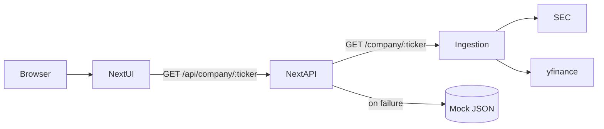

# TickerSense architecture

TickerSense is a hackathon MVP monorepo with two primary runtimes:

## Components

### `apps/web` (Next.js 14, App Router)

- **UI**: marketing home page, company research dashboard (`/company/[ticker]`).
- **BFF-style API routes**:
  - `GET /api/company/[ticker]` loads normalized company JSON, preferring the Python ingestion service and falling back to deterministic mock data.
  - `POST /api/ask` returns grounded copilot JSON. If `OPENAI_API_KEY` or `ANTHROPIC_API_KEY` is configured, it calls a provider; otherwise it returns a deterministic mock response.

### `services/ingestion` (FastAPI)

- **Purpose**: fetch authoritative SEC metadata/facts and basic market context, then return a single JSON payload the UI can render without scraping the browser.
- **Key integrations**:
  - SEC `company_tickers.json` for ticker → CIK resolution
  - SEC submissions JSON for recent filing metadata and archive URLs
  - SEC XBRL company facts JSON for a small financial snapshot (best-effort tags)
  - `yfinance` for price history and simple indicators

### `supabase/` (Postgres schema)

- Tables exist for persistence/caching (`companies`, `filings`, `filing_sections`, `market_snapshots`, `chat_sessions`, `chat_messages`).
- The MVP does not require Supabase to be configured for local demos; the web app should still run.

## Design principles (product + engineering)

- **Facts vs synthesis**: filing metadata and numeric facts should be visually separable from interpretive “insight” cards.
- **No advisory posture**: avoid buy/sell/hold language; include disclaimers in UI and API responses.
- **Resilience**: SEC and market data can fail due to rate limits, network issues, or missing tags. Prefer partial results + UI fallback rather than hard crashes.

## Local request flow

